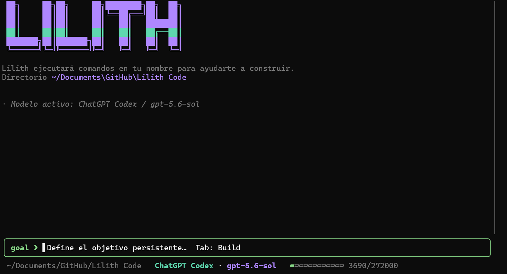
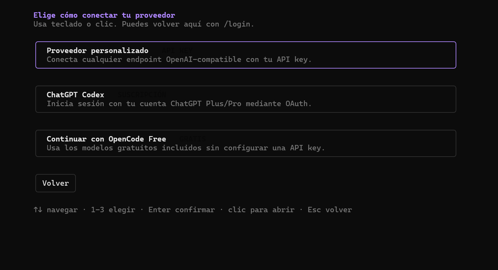
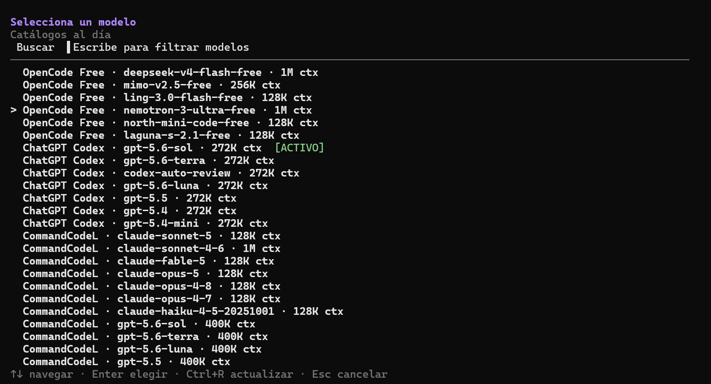
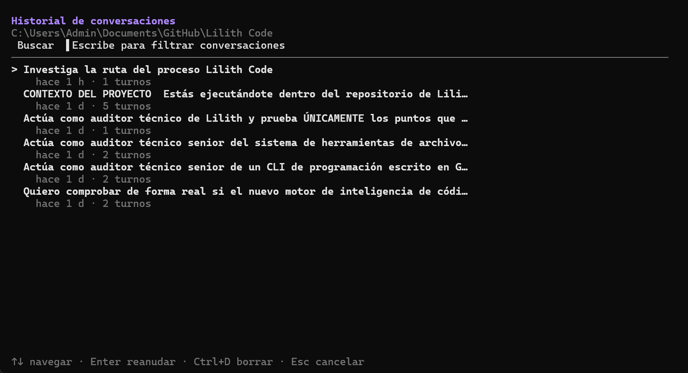
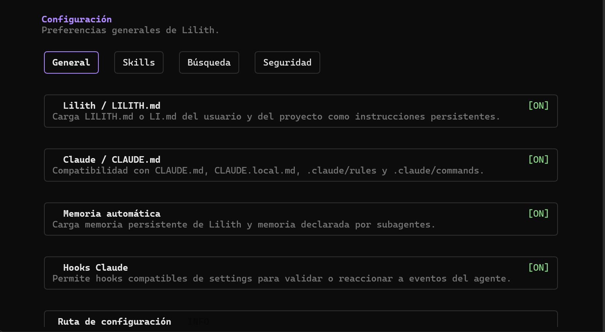
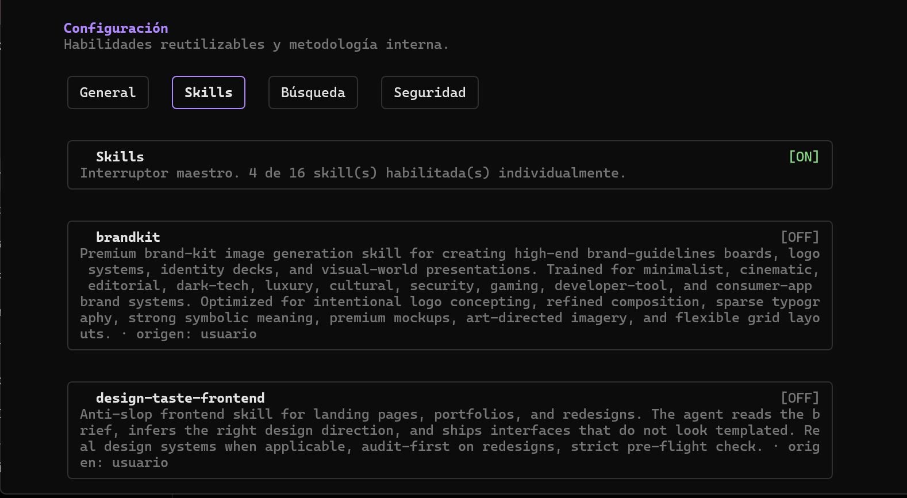
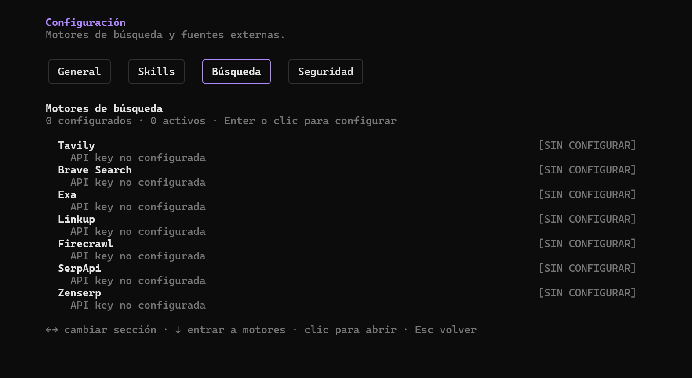

# Lilith

Lilith (`li`) es un agente de programación que trabaja directamente desde la
terminal. Puede analizar un proyecto, editar archivos, ejecutar comandos,
delegar trabajo a otros agentes y conservar tus conversaciones para continuar
más tarde.

Su interfaz está pensada para usarse con teclado o mouse tanto en Windows como
en Linux, macOS, servidores por SSH y Termux.

## Funciones principales

- Conversación en terminal con Markdown, razonamiento y ejecución de herramientas.
- Proveedores personalizados, ChatGPT Codex y modelos gratuitos de OpenCode Free.
- Cambio de modelo sin reiniciar la aplicación.
- Historial persistente de conversaciones con búsqueda, reanudación y borrado.
- Agentes y subagentes para dividir tareas grandes o ejecutar trabajo en paralelo.
- Skills reutilizables que pueden activarse o desactivarse individualmente.
- Knowledge local y lazy para consultar sintaxis/plataformas sin inflar cada prompt ni mezclar referencias con Skills.
- Búsqueda web mediante distintos motores configurables.
- Modos Build, Plan y Goal para implementar, planificar o mantener un objetivo.
- Lectura, edición y validación de proyectos en distintos lenguajes.
- Recuperación de sesiones y continuidad al trabajar en VPS o conexiones inestables.
- Conexiones SSH persistentes con servidores reutilizables y credenciales protegidas por una bóveda local.
- GitZip para empaquetar y desplegar proyectos respetando los archivos ignore del repositorio.

## Recorrido visual

<table>
  <tr>
    <td width="66%">
      <a href="docs/images/pantalla-principal.png">
        
      </a>
    </td>
    <td valign="top">
      <strong>Pantalla principal</strong>
      <ul>
        <li>Muestra el proyecto en el que estás trabajando.</li>
        <li>Indica el proveedor y modelo que están activos.</li>
        <li>Permite escribir solicitudes, instrucciones o un objetivo persistente.</li>
        <li>Enseña de forma visible cuánto contexto se está utilizando.</li>
        <li>Concentra la conversación, el progreso y las acciones del agente.</li>
      </ul>
    </td>
  </tr>
  <tr>
    <td width="66%">
      <a href="docs/images/inicio-sesion.png">
        
      </a>
    </td>
    <td valign="top">
      <strong>Conexión de proveedor</strong>
      <ul>
        <li>Permite conectar un endpoint compatible mediante una API key.</li>
        <li>Incluye acceso con una cuenta de ChatGPT Codex.</li>
        <li>Ofrece una ruta gratuita sin necesidad de configurar credenciales.</li>
        <li>Puede manejarse completamente con teclado o mediante clic.</li>
        <li>La pantalla puede abrirse nuevamente con <code>/login</code>.</li>
      </ul>
    </td>
  </tr>
  <tr>
    <td width="66%">
      <a href="docs/images/selector-modelos.png">
        
      </a>
    </td>
    <td valign="top">
      <strong>Selector de modelos</strong>
      <ul>
        <li>Agrupa los modelos disponibles por proveedor.</li>
        <li>Muestra la capacidad de contexto de cada opción.</li>
        <li>Permite filtrar rápidamente escribiendo en el buscador.</li>
        <li>Marca claramente cuál es el modelo activo.</li>
        <li>Puede actualizar los catálogos sin cerrar la conversación.</li>
      </ul>
    </td>
  </tr>
  <tr>
    <td width="66%">
      <a href="docs/images/historial-conversaciones.png">
        
      </a>
    </td>
    <td valign="top">
      <strong>Historial de conversaciones</strong>
      <ul>
        <li>Lista las conversaciones guardadas del proyecto actual.</li>
        <li>Muestra antigüedad y cantidad de turnos de cada sesión.</li>
        <li>Permite buscar por el contenido o título de la conversación.</li>
        <li>Una sesión puede reanudarse exactamente donde quedó.</li>
        <li>Las conversaciones que ya no se necesiten pueden eliminarse.</li>
      </ul>
    </td>
  </tr>
  <tr>
    <td width="66%">
      <a href="docs/images/configuracion-general.png">
        
      </a>
    </td>
    <td valign="top">
      <strong>Configuración general</strong>
      <ul>
        <li>Activa o desactiva las instrucciones persistentes de Lilith.</li>
        <li>Ofrece compatibilidad con archivos y reglas de Claude.</li>
        <li>Controla la memoria automática utilizada entre sesiones.</li>
        <li>Permite habilitar o deshabilitar los hooks compatibles.</li>
        <li>Reúne las preferencias principales en una sola pantalla.</li>
      </ul>
    </td>
  </tr>
  <tr>
    <td width="66%">
      <a href="docs/images/configuracion-skills.png">
        
      </a>
    </td>
    <td valign="top">
      <strong>Skills</strong>
      <ul>
        <li>Incluye un interruptor general para todas las habilidades.</li>
        <li>Cada skill puede activarse o desactivarse de forma independiente.</li>
        <li>Muestra una explicación clara de la finalidad de cada habilidad.</li>
        <li>Indica si la skill proviene del usuario, del proyecto o de Lilith.</li>
        <li>Las preferencias se conservan para las siguientes sesiones.</li>
      </ul>
    </td>
  </tr>
  <tr>
    <td width="66%">
      <a href="docs/images/configuracion-busqueda.png">
        
      </a>
    </td>
    <td valign="top">
      <strong>Motores de búsqueda</strong>
      <ul>
        <li>Reúne los proveedores de búsqueda compatibles en un solo lugar.</li>
        <li>Muestra cuáles están configurados y cuáles se encuentran activos.</li>
        <li>Permite abrir cada motor para agregar o actualizar sus credenciales.</li>
        <li>Admite Tavily, Brave Search, Exa, Linkup, Firecrawl, SerpApi y Zenserp.</li>
        <li>Puede utilizarse con teclado o mouse.</li>
      </ul>
    </td>
  </tr>
</table>

## Agentes y orquestación

Lilith puede delegar partes de una tarea a agentes especializados. Estos agentes
pueden trabajar en primer plano, continuar en segundo plano o dividir el trabajo
en nuevos subagentes cuando la tarea lo requiere.

El usuario puede seguir conversando, cancelar el trabajo, cambiar de sesión y
retomar tareas guardadas sin mezclar resultados entre conversaciones distintas.

## Skills configurables

Las skills agregan metodologías o capacidades reutilizables. Lilith incluye la
skill `ponytail-development` y también reconoce skills del usuario y del
proyecto.

Puedes administrarlas en:

```text
/config > Skills
```

También puedes invocar una directamente:

```text
/skill:ponytail-development revisar este proyecto
```

Al escribir `/`, los comandos y skills se ordenan por coincidencia real: una
coincidencia exacta como `/login` aparece antes que resultados difusos. `Tab`
completa el nombre y agrega automáticamente un espacio para continuar escribiendo.
Los comandos y las skills usan colores distintos tanto en la paleta como en el
token inicial del editor.

## SSH y bóveda segura

Lilith puede guardar perfiles de servidores, abrir conexiones SSH persistentes y
reutilizarlas para ejecutar comandos, navegar directorios, transferir archivos o
trabajar con una shell remota. Las contraseñas y passphrases se solicitan mediante
un popup enmascarado dentro del mismo chat: no se agregan a la conversación, no se
guardan en el historial y no se envían al modelo.

Cuando eliges conservar una credencial, Lilith la guarda cifrada en su bóveda
SSH. La bóveda no se abre al iniciar el CLI: su contraseña maestra se solicita
solamente cuando una conexión necesita por primera vez una credencial guardada.
Después permanece desbloqueada únicamente en memoria durante esa ejecución, por
lo que las tareas SSH posteriores no vuelven a pedirla. Las contraseñas de servidor
o passphrases solicitadas para una conexión directa también se retienen sólo en
memoria mientras esa conexión lógica exista, permitiendo reparar el transporte sin
mostrar el popup otra vez. Los textos distinguen explícitamente la contraseña
maestra de la bóveda, la contraseña de la cuenta del servidor remoto y la
passphrase de una clave privada. Guardar otra credencial reutiliza la bóveda ya
abierta: sólo aparece el campo correspondiente al servidor o a la clave privada.

Cada `connection_id` representa una conexión lógica estable. Si el servidor, la
red o un proxy cierran el transporte y producen `EOF`, Lilith abre un transporte
nuevo automáticamente sin cambiar el identificador. Los comandos que ya pudieron
haberse ejecutado no se repiten a ciegas: el resultado indica cuando el código de
salida quedó sin confirmar y permite verificar el estado usando el mismo
`connection_id`, sin cerrar ni reconectar manualmente. Un monitor detecta cierres
del transporte y el siguiente uso lo repara; `pwd`, `cd` y las operaciones SFTP
seguras se reintentan automáticamente. Los comandos SSH no tienen un límite
artificial predeterminado, para no cortar compilaciones o despliegues largos. Al
cerrar Lilith se cierran las conexiones y la bóveda vuelve a quedar bloqueada.

Las aprobaciones de acciones SSH aparecen como un widget dentro del mismo chat,
sin sustituir toda la interfaz. Puedes elegir la política desde:

```text
/config > Seguridad > SSH Remoto
```

Hay presets para proteger sólo cambios críticos, pedir permiso en cada acción,
pedirlo únicamente al ejecutar comandos o confiar en el modelo. También puedes
activar permisos específicos para conexiones, lecturas, comandos, cambios de
archivos, eliminaciones, perfiles/credenciales y bloqueo manual de la bóveda. En
cada solicitud puedes **permitir una vez**, **permitir durante la sesión**,
**permitir siempre esa acción para ese destino dentro del proyecto** o denegarla.
Los permisos permanentes del proyecto se pueden borrar desde la misma pantalla.

Las transferencias y operaciones de archivos no asumen que la sesión SSH pertenezca a `root`. Lilith intenta SFTP normalmente y, si una ruta como `/opt`, `/var/www` o `/etc` rechaza el acceso, sube primero a una ubicación temporal y publica el archivo mediante UID 0, `sudo` o `doas` sin contraseña. Si `sudo` necesita contraseña, aparece un popup local específico y el secreto se entrega por stdin; nunca se incorpora al comando ni al historial. La credencial se reutiliza sólo en memoria mientras la conexión lógica siga abierta. `privilege_mode=never` permite prohibir la elevación y `required` solicitarla desde el inicio. En comandos `exec` generales la elevación debe pedirse explícitamente con `required`, para evitar repetir automáticamente un comando que ya pudo aplicar cambios parciales.

## GitZip

GitZip crea archivos listos para compartir o desplegar sin incluir el historial
`.git` ni los elementos descartados por `.gitignore`. También reconoce reglas de
`.lilithignore`, `.codewolfignore`, `.codebuffignore` y `.manicodeignore`, incluso
cuando aparecen dentro de subdirectorios.

Puede crear ZIP, TAR o TAR.GZ en el equipo, subirlos mediante una conexión SSH,
construirlos directamente en el servidor y extraerlos de forma remota. Los
archivos `.env` reales quedan fuera por defecto y requieren una autorización
local independiente para incluirlos. El uso normal de GitZip no solicita una
confirmación genérica adicional. `source_path` permite empaquetar una carpeta
concreta; `include_paths` selecciona únicamente rutas o patrones determinados y
`exclude_paths` omite carpetas, archivos o globs adicionales. En operaciones remotas, GitZip comprueba antes si puede leer el origen y escribir en el destino; cuando son rutas protegidas ejecuta la creación, subida o extracción mediante el mismo mecanismo seguro de elevación, sin exigir que el usuario SSH sea `root`.

## Navegador persistente con Chromedp (experimental)

Lilith incluye una herramienta `browser` para controlar navegadores compatibles
con Chrome DevTools Protocol sin incorporar Chromium dentro del ejecutable. El
binario de Lilith puede seguir compilándose con `CGO_ENABLED=0`; el navegador se
detecta en el sistema o se proporciona mediante un endpoint CDP.

La herramienta puede descubrir Chrome, Chromium, Edge, Brave, Vivaldi, Opera,
Chrome for Testing y Chrome Headless Shell en ubicaciones habituales y entre los
procesos activos. El candidato recomendado puede guardarse como predeterminado.
Admite ejecución visible u oculta y tres clases de perfil:

- `temporary`: perfil aislado que se elimina al cerrar la sesión.
- `persistent`: perfil dedicado de Lilith que conserva cookies e inicios de sesión.
- `custom`: directorio dedicado indicado expresamente.

Por seguridad, Lilith rechaza perfiles que parezcan ser el perfil personal
predeterminado del usuario. Las contraseñas de formularios se introducen mediante
`fill_secret`, usando un popup local enmascarado que no envía el secreto al modelo.

Para ahorrar contexto, el modelo trabaja con snapshots compactos: título, URL,
texto acotado y elementos interactivos referenciados como `e1`, `e2`, etc. Después
del primer snapshot puede solicitar `delta=true` para recibir sólo cambios. También
puede inspeccionar consola, excepciones JavaScript, tráfico de red, cuerpos de
respuesta, fuentes cargadas, métricas, pestañas y capturas de pantalla. El
`session_id` mantiene la misma conexión CDP entre llamadas separadas, por lo que
`start`, `navigate`, `snapshot`, interacción y `screenshot` pueden ejecutarse en
turnos distintos sin volver a abrir el navegador.

Ejemplos de solicitudes:

```text
Abre https://example.com en un navegador visible con perfil temporal y analiza la consola y la red.
Abre el panel con un perfil persistente, inicia sesión y conserva la sesión para la próxima ejecución.
Prueba el formulario, usa snapshots delta y guarda una captura cuando falle.
```

Esta primera entrega se marca como experimental hasta completar la prueba integral
con Go 1.25.12 y un navegador real en Windows/Linux.

## Comandos útiles

| Comando | Acción |
|---|---|
| `/login` | Conectar o cambiar el proveedor. |
| `/models` | Elegir otro modelo. |
| `/history` | Abrir el historial de conversaciones. |
| `/config` | Administrar preferencias, skills, búsqueda y seguridad. |
| `/goal` | Crear o revisar el objetivo persistente del proyecto. |
| `/resume` | Reabrir el Goal pausado, interrumpido o completado sin cambiar su objetivo. |
| `/init [instrucciones]` | Inicializar `LILITH.md`, opcionalmente con indicaciones válidas sólo para esa ejecución. |
| `/clear` | Iniciar una conversación limpia. |
| `/exit` | Cerrar Lilith. |

## Atajos principales

| Atajo | Acción |
|---|---|
| `Enter` | Enviar el mensaje. |
| `Alt+Enter` | Encolar un mensaje para después del trabajo actual. |
| `Shift+Enter` o `Ctrl+Enter` | Insertar una nueva línea. |
| `Tab` | Alternar entre Goal y Build; desde Plan vuelve a Build. |
| `Esc` | Cancelar la tarea activa o volver a la pantalla anterior. |
| `Ctrl+C` | Limpiar el texto escrito en el campo de entrada. |

## Instalación

Las instrucciones para Windows, Linux, Termux, actualización, compilación,
pruebas y publicación se encuentran en [`install.md`](./install.md).

## Estado de las pruebas

La suite completa se valida con:

```cmd
test.cmd
```

La ejecución más reciente en Windows completó correctamente todos los paquetes,
incluidos `internal/subagents` e `internal/tui`, y finalizó con:

```text
all modules verified
Validación completada correctamente.
```

## Módulos y distribuciones privadas

Lilith usa un registry de módulos Go estáticos para sus propios comandos slash y
para extensiones privadas, sin plugins dinámicos ni CGO. Las capacidades
públicas viven físicamente en `modules/core/**` (`core.rewind`, `core.skills`,
`core.providers`, `core.session`, etc.); la TUI ya no inyecta un mega-módulo de
compatibilidad `core.commands`.

Una empresa puede mantener sus módulos exclusivamente en un repo/branch privado
y compilar con:

```bash
go run ./cmd/build build --distribution company
```

Eso añade el build tag `company` además de `grammar_set_core`. El repo público
no necesita importar ni conocer los paquetes privados. La guía completa está en
`docs/modules/README.md`.
